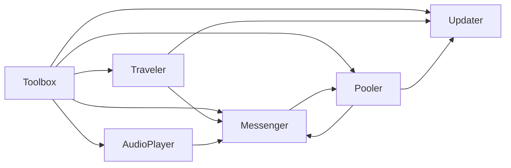

<p align="center">
  
</p>

<h1 align="center">VolumeBox Toolbox</h1>

<p align="center">
  <strong>Stop rebuilding the same Unity infrastructure in every project.</strong>
</p>

<p align="center">
  A focused runtime toolkit for lifecycle, updates, messaging, pooling, scene flow and audio.
</p>

<p align="center">
  <a href="https://openupm.com/packages/com.volumebox.toolbox/">
    
  </a>
  
  
  
</p>

---

**VolumeBox Toolbox** is an opinionated set of runtime systems for Unity designed around the problems that tend to be solved again in every project:

- hundreds of tiny `Update()` methods;
- lifecycle and initialization ordering;
- event subscriptions that outlive their owners;
- pooling code mixed into gameplay code;
- scene loading, initialization and argument passing;
- scattered `AudioSource` references and string handling;
- repetitive glue between all of the above.

Toolbox moves that infrastructure into a small set of systems with a shared lifecycle and a simple API.

```csharp
Toolbox.Updater
Toolbox.Messenger
Toolbox.Pooler
Toolbox.Traveler
Toolbox.AudioPlayer
```

## Why Toolbox?

| The usual Unity problem | Toolbox |
|---|---|
| Every component gets its own `Update` | Centralized `MonoCached` update dispatch |
| `Awake` / `Start` ordering becomes fragile | Explicit `Rise` → `Ready` lifecycle |
| Remembering to unsubscribe from events | Bind subscriptions to `GameObject` lifetime |
| Pool callbacks scattered across scripts | `IPooled<T>` + `IDespawn` |
| Searching and maintaining pooled instances | Pool-owned availability tracking and direct object lookup |
| Scene loading is coupled to gameplay code | Async additive `Traveler` + typed `SceneArgs` |
| Newly loaded scenes need manual initialization | Traveler automatically connects `MonoCached` objects |
| Audio clips and sources spread everywhere | Named albums, clip IDs and centralized playback |
| Systems work independently but need glue code | Toolbox systems understand each other's lifecycle |

The goal is not to replace Unity.

The goal is to remove the repetitive infrastructure between Unity and your gameplay code.

---

# Core systems

## MonoCached + Updater

A centralized alternative to thousands of independent Unity callbacks.

Instead of:

```csharp
public class Enemy : MonoBehaviour
{
    private void Awake() { }
    private void Start() { }

    private void Update() { }
    private void FixedUpdate() { }
    private void LateUpdate() { }
}
```

use:

```csharp
public class Enemy : MonoCached
{
    protected override void Rise()
    {
        // Awake-like initialization
    }

    protected override void Ready()
    {
        // Start-like initialization
    }

    protected override void Tick()
    {
        transform.position += transform.forward * delta;
    }

    protected override void FixedTick()
    {
    }

    protected override void LateTick()
    {
    }
}
```

`MonoCached` adds more than centralized dispatch:

- `Rise()` / `Ready()` lifecycle;
- `Tick()` / `FixedTick()` / `LateTick()`;
- independent render and fixed update intervals;
- accumulated delta for interval-based processing;
- manual `Pause()` / `Resume()`;
- inactive-object processing controls;
- time-scale control;
- automatic registration and removal;
- lifecycle hooks such as `Destroyed`, `OnActivate` and `OnDeactivate`.

For systems containing large numbers of small behaviours, centralized dispatch can substantially reduce callback overhead.

---

## Messenger

A typed message bus designed around Unity object lifetime.

```csharp
public sealed class PlayerDiedMessage : Message
{
    public int PlayerId;
}
```

Subscribe:

```csharp
Toolbox.Messenger.Subscribe<PlayerDiedMessage>(
    message =>
    {
        Debug.Log($"Player {message.PlayerId} died");
    },
    bind: gameObject
);
```

Send:

```csharp
Toolbox.Messenger.Send(new PlayerDiedMessage
{
    PlayerId = 42
});
```

Binding a subscription to a `GameObject` means Messenger can stop delivering messages when that object's lifetime ends.

Messenger supports:

- strongly typed messages;
- optional parameterless message caching;
- subscriptions bound to `GameObject` lifetime;
- scene-aware subscriber cleanup;
- pooled-object lifetime awareness;
- safe subscribe/unsubscribe during dispatch;
- nested/reentrant message sends;
- stable subscriber order;
- efficient bulk removal;
- message-type-specific dispatch instead of scanning unrelated subscribers.

You get decoupled gameplay events without turning subscription cleanup into another lifecycle problem.

---

## Pooler

Pooling should make allocation cheaper — not make your gameplay code harder to understand.

Create a pooled component:

```csharp
public sealed class BulletSpawnData
{
    public Vector3 Velocity;
}

public class Bullet : MonoCached, IPooled<BulletSpawnData>, IDespawn
{
    private Vector3 _velocity;

    public void OnSpawn(BulletSpawnData data)
    {
        _velocity = data.Velocity;
    }

    public void OnDespawn()
    {
        _velocity = Vector3.zero;
    }

    protected override void Tick()
    {
        transform.position += _velocity * delta;
    }
}
```

Spawn it:

```csharp
Toolbox.Pooler.Spawn(
    "bullet",
    position: muzzle.position,
    rotation: muzzle.rotation,
    data: new BulletSpawnData
    {
        Velocity = muzzle.forward * 20f
    }
);
```

Return it:

```csharp
Toolbox.Pooler.TryDespawn(bulletGameObject);
```

Pooler provides:

- tag-based pools;
- prewarming;
- automatic runtime expansion;
- typed `IPooled<T>` spawn data;
- non-generic `IPooled`;
- `IDespawn` callbacks;
- hierarchy-aware spawn/despawn callbacks;
- nested pooled-object handling;
- custom instantiate functions;
- custom spawn actions;
- automatic cleanup of excess unused objects;
- direct pooled-object lookup;
- explicit free-object tracking;
- automatic `MonoCached` initialization.

The normal prewarmed spawn/despawn path avoids hierarchy scans, reflection and full-pool searches.

---

## Traveler

Additive scene loading with an actual lifecycle.

```csharp
public class BattleSceneArgs : SceneArgs
{
    public int Level;
}

public class BattleSceneHandler : SceneHandler<BattleSceneArgs>
{
    protected override async UniTask SetupSceneAsync(BattleSceneArgs args)
    {
        Debug.Log($"Loading level {args.Level}");

        await UniTask.CompletedTask;
    }

    protected override async UniTask UnloadSceneAsync()
    {
        await UniTask.CompletedTask;
    }
}
```

Load:

```csharp
await Toolbox.Traveler.LoadScene<BattleSceneHandler>(
    "Battle",
    battleArgs
);
```

Traveler handles:

- asynchronous additive loading;
- asynchronous unloading;
- typed scene arguments;
- scene handlers;
- load/unload lifecycle callbacks;
- scene loading/opened/unloading/unloaded messages;
- synchronization between concurrent scene operations;
- automatic `MonoCached` initialization for loaded scenes;
- automatic update cleanup before unloading;
- scene handler lookup.

This keeps scene transitions and scene initialization out of unrelated gameplay code.

---

## AudioPlayer

A centralized audio layer built around named albums and clip IDs.

```csharp
Toolbox.AudioPlayer.Play(
    "Weapons",
    "RifleShot",
    volume: 0.8f,
    pitch: 1.0f
);
```

Or:

```csharp
Toolbox.AudioPlayer.PlayFormatted("Weapons/RifleShot");
```

AudioPlayer supports:

- named audio albums;
- clip IDs instead of direct references everywhere;
- album-specific `AudioSource` configuration;
- mixer groups;
- volume and pitch control;
- looping;
- multiple playback strategies;
- play / pause / stop operations;
- playback through Messenger;
- `AudioResource` support on newer Unity versions.

It is intended to keep audio configuration centralized while gameplay code only describes **what** should be played.

---

# Systems that work together

Toolbox systems are separate, but they share lifetime information where it matters.



Examples:

- `Traveler` initializes `MonoCached` components after loading a scene.
- `Traveler` removes them from `Updater` before unloading it.
- `Pooler` automatically initializes newly instantiated pooled objects.
- `Messenger` knows whether a bound pooled object is currently active.
- destroyed objects and unloaded scenes automatically participate in subscriber cleanup.
- Pooler lifecycle events can propagate through Messenger.

The systems are integrated where lifecycle matters without forcing gameplay code to manually coordinate them.

---

# Performance

Toolbox contains a dedicated Unity Performance Testing suite for its hot paths.

Current benchmark snapshot:

| Benchmark | Workload | Median |
|---|---:|---:|
| `MonoCached.Tick` — tiny workload | 10,000 callbacks / frame | **2.18 ms** |
| regular `MonoBehaviour.Update` — same workload | 10,000 callbacks / frame | **4.43 ms** |
| Pooler prewarmed Spawn | 10,000 objects | **71.7 ms** |
| Pooler prewarmed Despawn | 10,000 objects | **63.8 ms** |
| Messenger cached `Send<T>()` | 10,000 sends | **7.6 ms** |
| Messenger bulk unsubscribe | 10,000 subscribers | **5.1 ms** |

The important part is scaling:

```text
Prewarmed Pooler Spawn

100       ~0.57 ms
1,000     ~5.61 ms
5,000     ~32.51 ms
10,000    ~71.72 ms
```

```text
Prewarmed Pooler Despawn

100       ~0.71 ms
1,000     ~6.38 ms
5,000     ~31.49 ms
10,000    ~63.80 ms
```

The runtime hot paths are built around persistent indexes, stable collection compaction and cached lifecycle handlers rather than repeated LINQ queries, hierarchy traversal or reflection.

> **Benchmark environment:** Unity 6000.4.0f1, Windows Editor, Mono scripting backend, Ryzen 5 4600G.
>
> These numbers are intended for relative comparison and scaling analysis, not as guaranteed timings for every platform or project.

---

# Tested

The current PlayMode suite contains:

<p align="center">
  <strong>215 / 215 tests passing</strong>
</p>

Coverage includes:

- MonoCached lifecycle and interval behavior;
- Updater registration and removal;
- Messenger dispatch and nested sends;
- mutation during message dispatch;
- message caching;
- subscriber lifetime cleanup;
- Pooler spawn/despawn lifecycle;
- typed pooled data;
- runtime pool expansion;
- nested pooled objects;
- garbage collection;
- scene lifecycle behavior;
- performance regression benchmarks.

Correctness is tested together with the awkward lifecycle edge cases that tend to break runtime infrastructure.

---

# Installation

## OpenUPM

Recommended:

```bash
openupm add com.volumebox.toolbox
```

Package:

```text
com.volumebox.toolbox
```

Toolbox declares **UniTask** as its runtime package dependency.

After installation, the runtime systems are exposed through:

```csharp
Toolbox.Messenger
Toolbox.AudioPlayer
Toolbox.Pooler
Toolbox.Updater
Toolbox.Traveler
```

---

# Design philosophy

Toolbox is built around a few rules.

### Gameplay code should describe gameplay

Infrastructure such as object reuse, message lifetime, update dispatch and scene bookkeeping should not dominate gameplay classes.

### Hot paths should stay boring

Runtime-critical paths prefer:

- indexed iteration;
- cached metadata;
- direct lookups;
- persistent collections;
- predictable lifecycle transitions;

over repeated:

- LINQ;
- reflection;
- hierarchy traversal;
- temporary collections.

### Lifetime should be explicit

Spawn, initialize, subscribe, update, unload and despawn are not unrelated events.

Toolbox treats them as parts of the same object lifecycle.

### Optimize measured problems

The repository includes performance benchmarks for Updater, Messenger and Pooler so optimizations can be validated against real workloads instead of intuition.

---

# When Toolbox is a good fit

Toolbox is especially useful when your project has:

- many lightweight runtime behaviours;
- frequently spawned/despawned objects;
- multiple additive scenes;
- event-driven systems;
- reusable gameplay prefabs;
- centralized audio requirements;
- systems whose lifetime spans scenes and pooled objects.

It is deliberately more opinionated than a collection of extension methods, but much smaller than replacing your project architecture with a completely different programming model.

---

# Documentation

> [!NOTE]
> The documentation is currently being updated to match the latest Toolbox release.

The existing documentation site is still available here:

**[Legacy documentation](https://gariestgary.github.io/toolbox/about/)**

For the current runtime behavior, the repository tests and public APIs are the most up-to-date reference until the documentation refresh is complete.

---

# Package

```text
Name:       com.volumebox.toolbox
Namespace:  VolumeBox.Toolbox
Registry:   OpenUPM
Dependency: UniTask
```

---

<p align="center">
  <strong>Build gameplay. Keep the infrastructure in the Toolbox.</strong>
</p>
